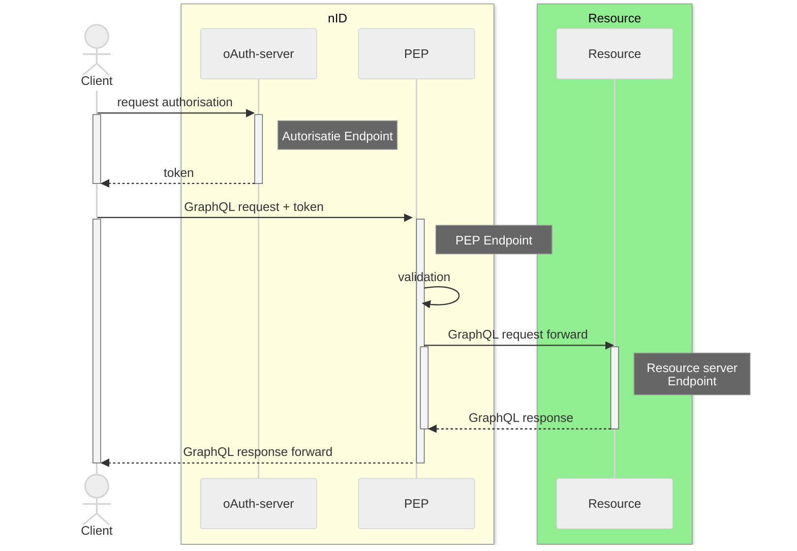

# iWlz-adresboek

> [!IMPORTANT]
> Tijdelijk alternatief voor adresboek tot de beschikbaarheid van de generieke functie of bruikbaarheid van Zorg-AB binnen het netwerk.

- [iWlz-adresboek](#iwlz-adresboek)
  - [Inleiding](#inleiding)
  - [Opbouw adreslijst](#opbouw-adreslijst)
  - [Schema](#schema)
    - [Voorbeeld](#voorbeeld)
- [Adresgegevens](#adresgegevens)
  - [Beheer](#beheer)
- [meer informatie:](#meer-informatie)


## Inleiding

Binnen het iWLZ-netwerk wordt informatie gedeeld via registers die te benaderen zijn met GraphQL. Om te ontdekken hoe registers en bijbehorende services in het netwerk bereikt kunnen worden is er een adresboek nodig. Het fungeert als ware een register dat informatie bijhoudt over de verschillende gegevensdiensten die worden aangeboden door verschillende netwerkdeelnemers.

De [RFC0003 - Adresboek](https://github.com/iStandaarden/iWlz-RequestForComment/blob/main/RFC/RFC0003%20-%20Adresboek.~~md~~) is hiervoor opgesteld maar intussen is voor het Adresboek de bestaande voorziening ZorgAB voorzien. ZorgAB is alleen nu nog niet geschikt voor gebruik binnen het iWlz Netwerk maar uiteindelijk aansluiting is wel het einddoel.

Tot dat moment zal hier de lijst met benodigde endpoints worden bijgehouden in een van ZorgAB afgeleid formaat.

Het formaat (schema) is opgesteld in een eerste analyse hoe Zorg-AB ingezet kan worden in het iWlz netwerk.

## Opbouw adreslijst
De opbouw van de lijst is gebaseerd op de complete OAuth-flow voor het netwerk en gaat uit van alle benodigde uri voor het benaderen van één resource doel. Zie het vereenvoudigde sequentie-diagram hieronder (meer detail in de Request for Comment [RFC0014 - Functionele uitwerking aanvragen van autorisatie](https://github.com/iStandaarden/iWlz-RequestForComment/blob/main/RFC/RFC0014%20-%20Functionele%20uitwerking%20aanvragen%20van%20autorisatie.md)).



De flow toont dat er voor het benaderen van een register, **de Resource**, langs drie componenten moet worden gegaan. Dit zijn:
1. de **Autorisatie server**: voor het vragen van de benodigde toegang.
2. de **PEP**: voor de validatie en toegang tot de resource.
3. de **Resource**: waar het register met brondata te vinden is.

Elke van deze 3 componenten hebben een eigen **endpoint**. Er worden daarom **per doel(-server) ook drie endpoints** vastgelegd.

> [!NOTE]
> Op dit moment voorziet nID binnen het iWlz-netwerkstelsel de centrale voorziening van de Autorisatie server en PEP. Hierdoor zijn de url van deze twee voorzieningen voor elk huidig doel gelijk. In de toekomst kan dit misschien veranderen en kunnen er ook andere PEP of Autorisatieserver instanties worden toegevoegd voor een doel.


## Schema

Het [schema](./src/zab_electronicservices.json) is gebaseerd op de _ElectronicService_ entiteit uit het Zorg-AB datamodel.

| ZAB Element                | Beschrijving                       | Voorbeeld                                                       |
| :------------------------- | :--------------------------------- | :-------------------------------------------------------------- |
| description                | Omschrijving service               | TEST OMGEVING Voor het raadplegen van het Wlz Indicatieregister |
| gegevensdienstId           | Identificatie van servicecomponent | CIZ_INDICATIE_TST                                               |
| weergavenaam               | Weergave naam in ZAB               | TEST OMGEVING - Wlz Indicatieregister                           |
| authorizationEndpoint      | PEP Endpoint                       |                                                                 |
| - authorizationEndpointuri | uri                                | "some.PEP.endpoint.url"                                         |
| tokenEndpoint              | Autorisatieserver endpoint         |                                                                 |
| - tokenEndpointuri         | uri                                | "some.autorisatie.server.url"                                   |
| systeemrollen              | array van systeemrol               |                                                                 |
| "systeemrol"               | <placeholder>                      |                                                                 |
| - systeemrolcode           | Type systeem                       | TEST-RESOURCE-SERVER                                            |
| resourceEndpoint           | <placeholder>                      |                                                                 |
| - resourceEndpointuri      | uri                                | "test.sometest.url"                                             |

### Voorbeeld 
Het voorbeeld bevat voorbeeldgegevens voor het benaderen van 2 functionele resources:
1. Het eerste voorbeeld is voor het benaderen van de resource: Test omgeving Indicatieregister.
2. Het tweede voorbeeld is voor het benaderen van de resource: Test omgeving Bemiddelingsregister van zorgkantoor regio 5555

json:

```json
{
  "_comment": "iWlz service lijst - versie 0.1 - 12-11-2024",
  "electronicServices": [
    {
      "description": "TEST OMGEVING Voor het raadplegen van het Wlz Indicatieregister",
      "gegevensdienstId": "CIZ_INDICATIE_TST",
      "weergavenaam": "TEST OMGEVING - Wlz Indicatieregister",
      "authorizationEndpoint": {
        "_comment": "TEST OMGEVING - PEP Endpoint",
        "authorizationEndpointuri": "https://fictief.PEP.adres/"
      },
      "tokenEndpoint": {
        "_comment": "TEST OMGEVING - Autorisatieserver",
        "tokenEndpointuri": "https://fictief.autorisatie.punt"
      },
      "systeemrollen": [
        {
          "systeemrolcode": "Register",
          "resourceEndpoint": {
            "_comment": "CIZ Indicatieregister",
            "resourceEndpointuri": "https://test.graphql.end.punt.ciz"
          }
        }
      ]
    },
    {
      "description": "TEST OMGEVING Voor het raadplegen van het Bemiddelingsregister zorgkantoor 5555",
      "gegevensdienstId": "5555_BR_TST",
      "weergavenaam": "TEST OMGEVING - Wlz 5555 Bemiddelingsregister",
      "authorizationEndpoint": {
        "_comment": "TEST OMGEVING - PEP Endpoint",
        "authorizationEndpointuri": "https://fictief.PEP.adres/"
      },
      "tokenEndpoint": {
        "_comment": "TEST OMGEVING - Autorisatieserver",
        "tokenEndpointuri": "https://fictief.autorisatie.punt"
      },
      "systeemrollen": [
        {
          "systeemrolcode": "Register",
          "resourceEndpoint": {
            "_comment": "5555 Bemiddelingsregister",
            "resourceEndpointuri": "https://test.5555.resource.punt"
          }
        }
      ]
    }
  ]
}
```

> [!NOTE] 
> Het voorbeeld laat ook zien dat voor de twee **resources** de endpoints voor de autorisatie en PEP gelijk zijn omdat nID voor beide resources deze functies vervult.

# Adresgegevens

> [!TIP]
> **De Adreslijst is te vinden in de afgeschermde repository: [iWlz-adresboek-private](https://github.com/iStandaarden/iWlz-adresboek-private)**
> Om toegang te krijgen tot deze repository is:
> 1. Account nodig op Github
> 2. Toegevoegd worden als member.
> 3. Stuur daarna een bericht met vermelding van "Aanvraag toegang iWlz Adresboek private met meegeven van organisatie en githubaccount aan Dennis de Gouw - [@dennisdegouw](http://github.com/dennisdegouw) of Remo van Rest - [@rvanrest](https://github.com/rvanrest)
> 4. Je zal daarna een uitnodiging krijgen tot de private-repository

## Beheer

Neem voor het laten doorvoeren van wijzingen contact op met:

- servicedesk iStandaarden: [info_at_istandaarden.nl](info@istandaarden.nl)
- Dennis de Gouw - [@dennisdegouw](http://github.com/dennisdegouw)
- Remo van Rest - [@rvanrest](https://github.com/rvanrest)

# meer informatie:

- Actieprogramma iWlz: van keten naar netwerk: [het Actieprogramma iWlz](https://www.istandaarden.nl/iwlz/actieprogramma/index "Over Actieprogramma iWlz")
- Informatiemodel iStandaarden iWlz: [Informatiemodellen](https://informatiemodel.istandaarden.nl)
- Portaal voor iStandaarden in de Zorg en Ondersteuning: [homepagina iStandaarden](https://www.istandaarden.nl)
- Zorg-AB: https://www.vzvz.nl/diensten/gemeenschappelijke-diensten/zorg-ab
